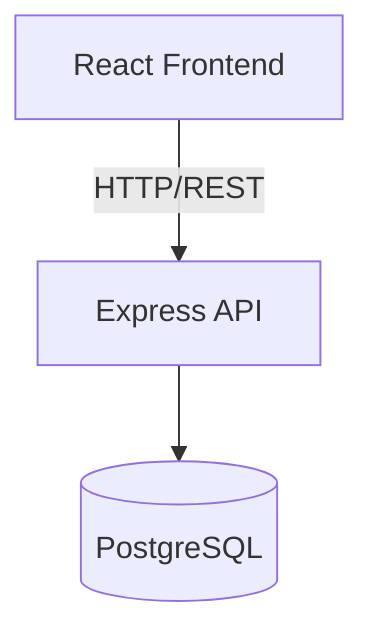

# Architecture Overview

## System summary

<Two or three sentences describing what the system does and what kind of application it is.>

## Architecture style

<Describe the architecture style selected and the main components and how they relate. Use a Mermaid diagram if it adds clarity. For example in a 3-layer architecture:>

## Components

<Describe the main components of the system and their responsibilities. For example in a 3-layer architecture:>

| Component | Responsibility |
|-----------|----------------|
| Presentation | React components, routing, state management |
| Service | Business logic, orchestration |
| Database | PostgreSQL — persistent storage |

## Key decisions

<List each ADR with a one-line summary and a link. For example:>

- [ADR-001 — 3-layer architecture](adr/ADR-001-3layer.md) — separates concerns across routes, services, and repositories
- [ADR-002 — PostgreSQL](adr/ADR-002-postgresql.md) — relational model suits the project/task domain
- ...

## Technology stack

<List the main technologies used in the system. For example:>

| Technology | Version |
|------------|---------|
| React | 18+ |
| Node.js + Express | — |
| PostgreSQL | — |
| Docker Compose | — |