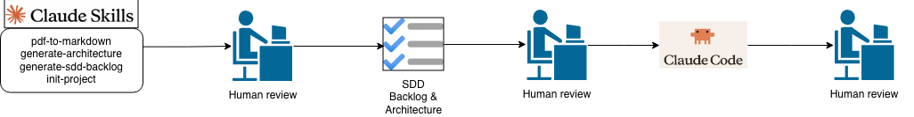

# Development process

This process uses AI throughout the entire process, from requirements analysis through system development and testing.

The built skills are brought together in `.claude/skills/init-project` to analyze a requirements document generating a system architecture and a backlog that can be interpreted by a code agent for development, such as Claude Code

Human reviews refine the code and documentation generated by AI; this can be viewed as a traditional code review process.