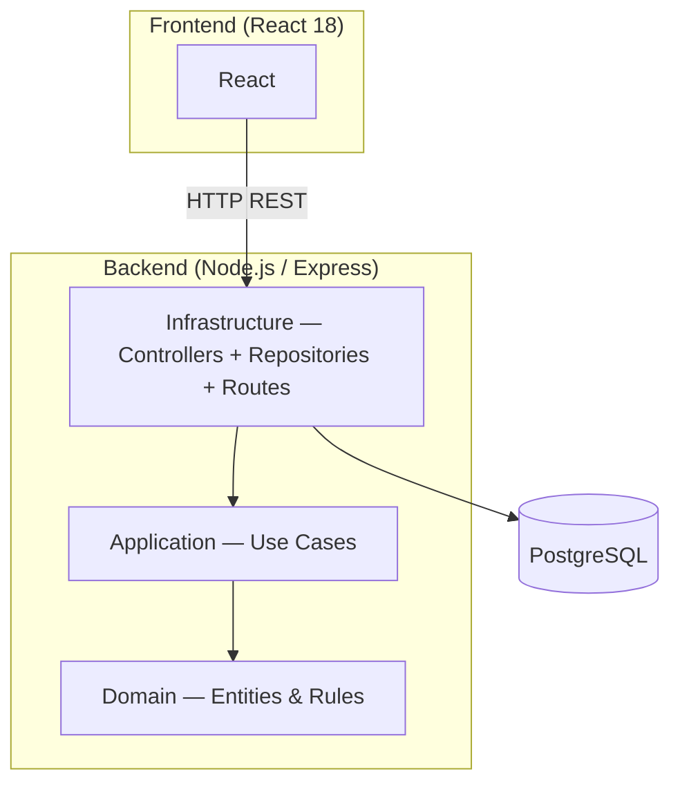
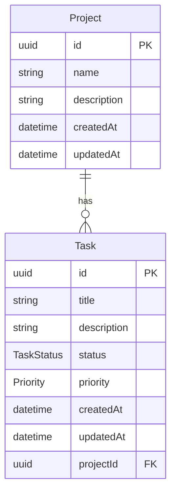

# Architecture Overview

## System summary

A full-stack project task management application that allows users to create projects, associate tasks with statuses and priority levels, and visualise that information through a web interface. The system consists of a React 18 frontend, a Node.js/Express REST API, and a PostgreSQL database, all orchestrated locally via Docker Compose.

## Architecture style

The overall style is a **monolith** (3-tier architecture) — a single backend service and a single frontend application. The backend is internally structured following **Clean Architecture**, with strict inward dependency flow across three layers: `domain`, `application`, and `infrastructure`.

Dependency rule: arrows always point inward — `Infrastructure → Application → Domain`. No layer imports from an outer one.

## Components

| Component | Layer | Responsibility |
|-----------|-------|----------------|
| React | Frontend | Renders UI; consumes API via React Query |
| Controllers | Infrastructure | HTTP request/response handling; input validation |
| Repositories | Infrastructure | Data access; translates domain objects to/from PostgreSQL rows |
| Routes | Infrastructure | Entry point. |
| Use Cases | Application | Orchestrates domain logic; defines application interfaces |
| Domain Entities | Domain | Core business rules: task states, priorities, project invariants |
| PostgreSQL | Database | Persistent relational storage |

## Data model

`TaskStatus`: `PENDING | IN_PROGRESS | DONE`  
`Priority`: `LOW | MEDIUM | HIGH`

## Key decisions

See `adr/`

## Technology stack

| Technology | Version | Role |
|------------|---------|------|
| React | 18+ | Frontend framework |
| Node.js | LTS | Backend runtime |
| Express | 4+ | HTTP framework |
| PostgreSQL | 16 | Relational database |
| Prisma | 5+ | ORM + migration tooling |
| TypeScript | 5+ | Type safety across frontend and backend |
| Docker Compose | v2 | Local environment orchestration |
