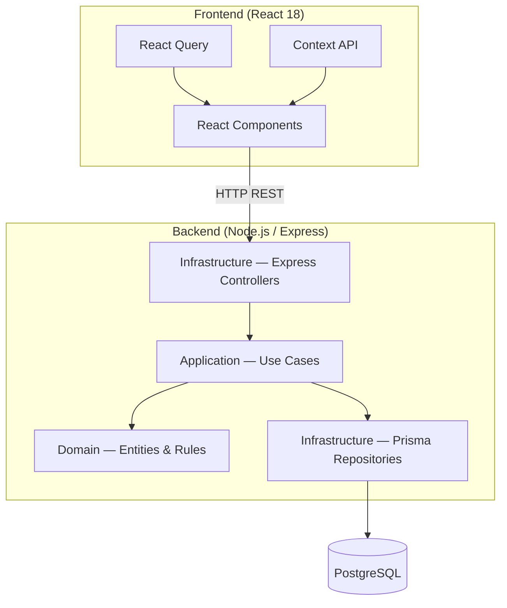

# Architecture Overview

## System summary

A full-stack project task management application that allows users to create projects, associate tasks with statuses and priority levels, and visualise that information through a web interface. The system consists of a React 18 frontend, a Node.js/Express REST API, and a PostgreSQL database, all orchestrated locally via Docker Compose.

## Architecture style

The overall style is a **monolith** — a single backend service and a single frontend application. The backend is internally structured following **Clean Architecture**, with strict inward dependency flow across three layers: `domain`, `application`, and `infrastructure`.

## Components

| Component | Layer | Responsibility |
|-----------|-------|----------------|
| React Components | Frontend | Renders UI; consumes API via React Query |
| React Query | Frontend | Server state management: caching, fetching, mutation |
| Context API | Frontend | Client/UI state: selected project, notifications |
| Express Controllers | Infrastructure | HTTP request/response handling; input validation |
| Use Cases | Application | Orchestrates domain logic; defines application interfaces |
| Domain Entities | Domain | Core business rules: task states, priorities, project invariants |
| Prisma Repositories | Infrastructure | Data access; translates domain objects to/from PostgreSQL rows |
| PostgreSQL | Database | Persistent relational storage |

## Key decisions

- [ADR-001 — Monolith](adr/ADR-001-monolith.md) — single backend + frontend; appropriate scope for the domain
- [ADR-002 — Clean Architecture](adr/ADR-002-clean-architecture.md) — domain / application / infrastructure layers with strict inward dependencies
- [ADR-003 — Node.js with Express](adr/ADR-003-nodejs-express.md) — minimal framework, architecture is explicit not framework-imposed
- [ADR-004 — PostgreSQL](adr/ADR-004-postgresql.md) — relational model enforces referential integrity between projects and tasks
- [ADR-005 — Prisma ORM](adr/ADR-005-prisma.md) — type-safe queries; confined to infrastructure layer
- [ADR-006 — REST API](adr/ADR-006-rest-api.md) — resource-oriented, stateless, universally understood
- [ADR-007 — React 18](adr/ADR-007-react18.md) — required by the challenge; functional components and hooks
- [ADR-008 — React Query + Context API](adr/ADR-008-state-management.md) — server state and UI state kept separate and explicit
- [ADR-009 — Monorepo](adr/ADR-009-monorepo.md) — single repo for frontend + backend; one clone to run everything
- [ADR-010 — Docker Compose](adr/ADR-010-docker-compose.md) — reproducible local environment; one command to start the full stack
- [ADR-011 — Prisma Migrate](adr/ADR-011-prisma-migrate.md) — versioned schema migrations committed alongside application code

## Technology stack

| Technology | Version | Role |
|------------|---------|------|
| React | 18+ | Frontend framework |
| TanStack Query (React Query) | v5 | Server state management |
| Node.js | LTS | Backend runtime |
| Express | 4+ | HTTP framework |
| PostgreSQL | 16 | Relational database |
| Prisma | 5+ | ORM + migration tooling |
| TypeScript | 5+ | Type safety across frontend and backend |
| Docker Compose | v2 | Local environment orchestration |
